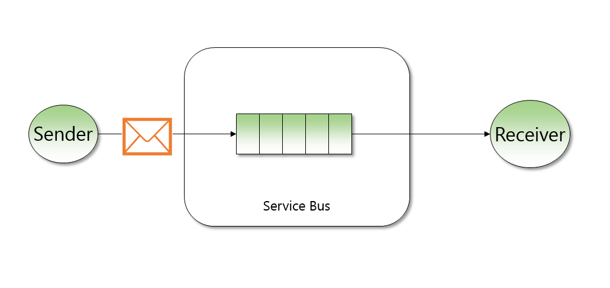
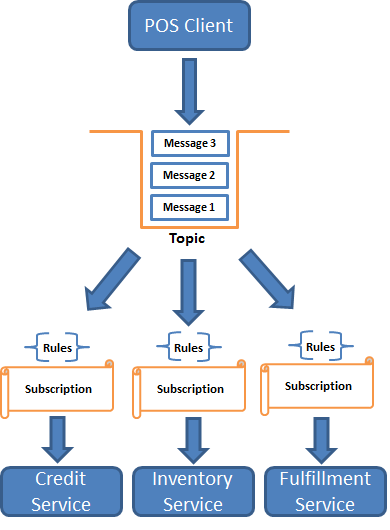
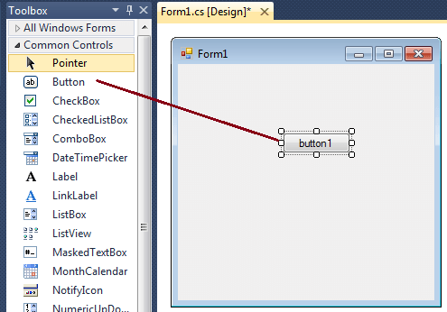
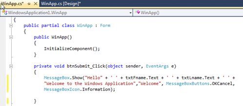

- title : Service Bus Workshop
- description : Service Bus Workshop
- author : Krystian Kolad
- theme : night
- transition : default

***

## Service Bus Workshop

***

## Komunikacja między różnymi serwisami

---

## Problemy komunikacji:
* niezależność komponentów
* podczas wywoływania metod z innych serwisów:
    * przy zmianie w jednym serwisie, należy zmienić coś w innym
    * brak niezależności

---

## Rozwiązanie?

---

## Komunikacja 
* Events
* Messages
* Commands
* ...

***

## Service bus

---

## O co chodzi?
* Miejsce, w którym wysyłamy wiadomości
* Każdy może te wiadomości zdjąć
* Możliwość wykorzystania wiadomości przez więcej niż jeden komponent

---

## Schemat działania v1

---

## Schemat działania v2

***

## Demo

***

##Czy wiecie, że...
Każdy z was korzystał z eventów?

---

##Co to?

---

##A to?

***

## Pytania

***

## Dziękuję za uwagę

***